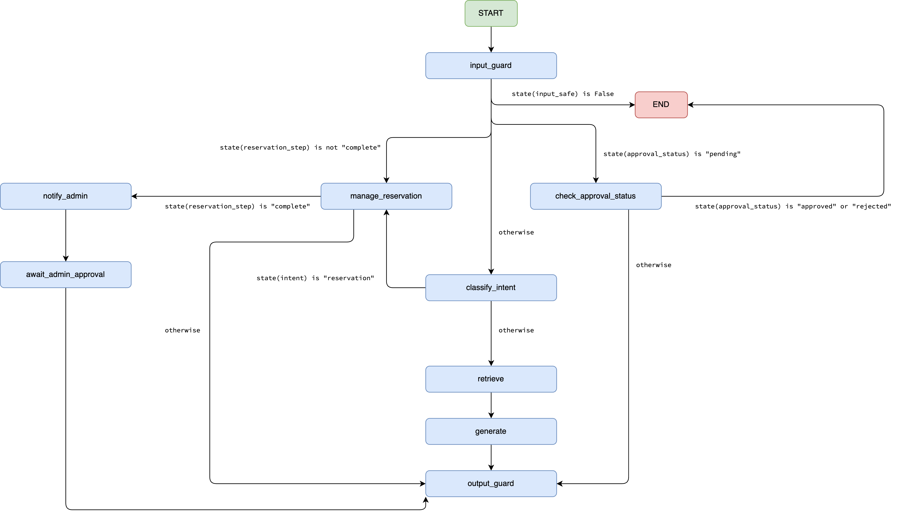

# Slytherin Parking Assistant — Stages 1 & 2

An intelligent parking assistant chatbot built with **LangChain**, **LangGraph**, **Pinecone**, and **OpenAI**, using a Retrieval-Augmented Generation (RAG) architecture with a human-in-the-loop reservation approval workflow.

---

## Architecture



### Human-in-the-loop flow

```
1. User completes reservation form (name → surname → plate → dates)
2. notify_admin_node  →  sends notification (email or log file)
                      →  saves to pending_reservations.json
                      →  graph PAUSES (interrupt_before await_admin_approval)
3. Admin Panel (pages/1_Admin_Panel.py)
       Approve / Reject
         │
         ├── graph.update_state({approval_status: "approved"|"rejected"})
         └── graph.invoke(None, config)  →  await_admin_approval_node runs
                                         →  LLM generates decision message
                                         →  user chat updates automatically
4. User chat auto-polls every 3 s while approval_status == "pending"
   Send button is disabled during this period.
```

---

## Project structure

```
parking_assistant/
├── app.py                          # Streamlit chat UI (user-facing)
├── config.py                       # Pydantic settings — reads .env
├── requirements.txt
├── .env.example
├── .gitignore
│
├── pages/
│   ├── 1_Admin_Panel.py            # Admin approval UI (human-in-the-loop)
│   └── 2_Reservations.py           # Reservations table (all statuses)
│
├── graph/
│   ├── state.py                    # ParkingState TypedDict (forward-compatible)
│   ├── nodes.py                    # All node functions
│   └── builder.py                  # Graph topology + get_graph() singleton
│
├── agents/
│   └── admin_agent.py              # Second LangChain agent: formats admin
│                                   #   notifications and decision messages
│
├── notifications/
│   └── notifier.py                 # SMTP email sender (file-log fallback)
│
├── store/
│   └── pending_reservations.py     # JSON file store shared by chat + admin panel
│
├── rag/
│   ├── retriever.py                # Pinecone vector store + retrieve()
│   └── prompts.py                  # All prompt templates
│
├── guardrails/
│   └── filter.py                   # check_input() + check_output()
│
├── data/
│   └── parking_documents.py        # 10 static parking docs seeded to Pinecone
│
├── evaluation/
│   └── metrics.py                  # Precision@K, Recall@K, MRR, latency
│
├── scripts/
│   ├── seed_pinecone.py            # One-time Pinecone seeding script
│   └── run_eval.py                 # Offline RAG evaluation report
│
└── tests/
    ├── test_rag.py                 # Node unit tests (mocked API calls)
    ├── test_guardrails.py          # Guardrail unit tests
    └── test_evaluation.py          # Metric function unit tests
```

---

## Setup

### 1. Install dependencies

```bash
python -m venv .venv
source .venv/bin/activate        # Windows: .venv\Scripts\activate
pip install -r requirements.txt
```

### 2. Configure environment

```bash
cp .env.example .env
```

Edit `.env` and fill in your keys:

```env
OPENAI_API_KEY=sk-...
PINECONE_API_KEY=pcsk_...
PINECONE_INDEX_NAME=parking-assistant

# Optional — SMTP for admin email notifications
# If not set, notifications are written to admin_notifications.log instead
SMTP_HOST=smtp.gmail.com
SMTP_PORT=465
SMTP_USER=you@gmail.com
SMTP_PASSWORD=your_app_password
ADMIN_EMAIL=admin@yourcompany.com
```

### 3. Seed Pinecone

Run **once** to embed and upload the 10 parking documents:

```bash
python scripts/seed_pinecone.py
```

### 4. Run the app

```bash
streamlit run app.py
```

Three pages are available in the sidebar:

| Page | URL path | Purpose |
|---|---|---|
| Chat | `/` | User-facing chatbot |
| Admin Panel | `/Admin_Panel` | Approve / reject reservations |
| Reservations | `/Reservations` | Table of all reservations |

### 5. Run the RAG evaluation

```bash
python scripts/run_eval.py
```

### 6. Run the tests

```bash
pytest tests/ -v
```

---

## Guardrails

Two-layer filtering on every turn — **context-aware**: during reservation field collection the LLM checks are skipped to avoid false positives on short answers like `"Alice"` or `"ABC-1234"`.

**Input guardrail** (`guardrails/filter.py → check_input`):
1. Fast keyword check — blocks prompt injection / jailbreak attempts
2. LLM topic-relevance check — must be parking-related *(skipped during reservation collection)*

**Output guardrail** (`guardrails/filter.py → check_output`):
1. Regex check — blocks API keys, admin credentials, internal config patterns
2. LLM leakage check — detects other users' personal data *(skipped during reservation collection)*

---

## RAG Evaluation metrics

Run via `python scripts/run_eval.py`. Prints a per-query and aggregate report.

| Metric | Description |
|---|---|
| `Precision@K` | Of the top-K retrieved docs, what fraction are relevant? |
| `Recall@K` | Of all relevant docs, what fraction appear in top-K? |
| `MRR` | Mean Reciprocal Rank — 1/rank of first relevant doc |
| `Latency` | Wall-clock time per retrieval call |

---

## Key design decisions

| Decision | Rationale |
|---|---|
| `ParkingState` has `Optional` Stage 3-4 fields | Zero-migration cost when extending to future stages |
| `output_guard_node` is the only node that appends to `messages` | Prevents `add_messages` reducer duplicates |
| `MemorySaver` singleton shared across pages | Admin panel can resume the same paused graph thread |
| Guardrails skip LLM checks during reservation collection | Prevents false positives on valid short field values |
| Pending store is a JSON file | Simple, inspectable, no extra infrastructure needed |

---

## Roadmap

| Stage | Status | Description |
|---|---|---|
| **1** | ✅ Done | RAG chatbot, Pinecone, guardrails, evaluation |
| **2** | ✅ Done | Human-in-the-loop admin approval, reservations table |
| **3** | ⬜ Next | MCP server writes confirmed reservations to file |
| **4** | ⬜ Future | Full LangGraph orchestration of all components |
